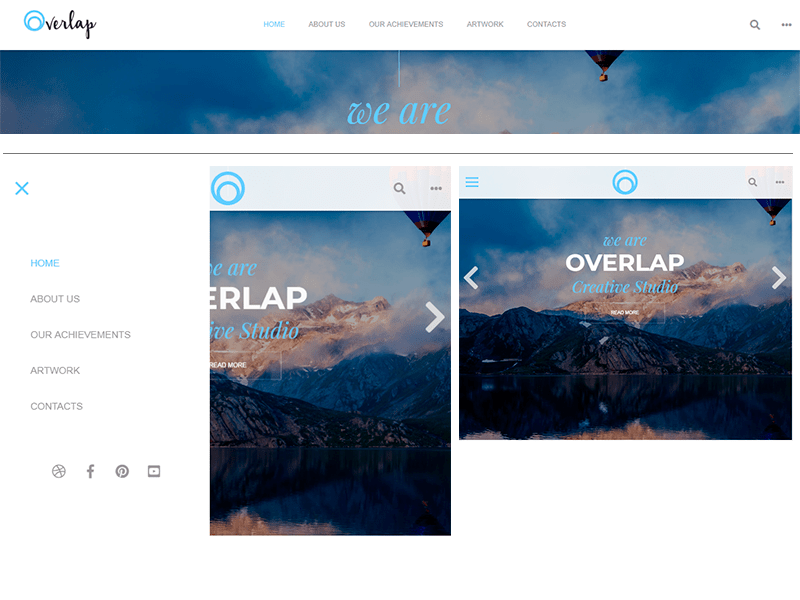

# Kai-menu

#### (Адаптивное меню с мобильной версией на jQuery и CSS3)

***

### Вы можете скачать Kai-menu Zip архивом.
[](https://github.com/AndreiKaragayr/kai-menu.git)


***

### Про библиотеку:
1. Kai-menu - это библиотека на jQuery, её задача создавать адаптивное меню для desktop и мобильных устройств.
2. Меню становится адаптивным с 900px
3. В Kai-menu уже предусмотрен Поиск и кнопка скроллинга страницы вверх.
4. Kai-menu настраиваемая библиотека которая содержит настройки в файле ` kai_menu.js ` :

  + `timeTransition:` - время анимации элементов меню
  + `timeUp:`  - продолжительность скроллинга страницы по нажатию на кнопку Вверх
  + `searchAction:` - адрес сервера для запроса поиска
  + `searchMethod:` - метод запроса на сервер
  + `searchPlaceholder:` - подсказка для поиска
  + `iconToUp:` -  иконка для кнопки вверх
  + `colorLink:`  - цвет ссылок и иконок
  + `colorHover:`  - цвет при наведении и активных ссылок

>**Главные плюсы меню Kai-menu:**
>1. Мобильная версия:
> - появляется кнопка мобильного меню
> - появляется анимация в мобильной версии
>2. При скроллинге меню анимируется:
>  -  уменьшается в размере
> - приобретает прозрачность
> - меню всегда сверху страницы
> -  уменьшается логотип на мини версию
>3. Дополнительный набор иконок справа
>4. Встроенная форма поиска
>5. Встроенная кнопка скроллинга страницы вверх

  
#### В Kai-menu  входит:
 - папка `css` - стили kai_menu и стили иконок fontawesome v5
 - папка `js` - библиотеки kai_menu и jquery v3
 - папка `img` - картинки для демо
 - `demo.html` - презентационная версия библиотеки
 - `sampel.html` - простая структура меню

***

### Технические зависимости:
  + [jquery](https://jquery.com/)
  + [fontawesome v5 icon-free](https://fontawesome.com/)


### Шаги по установке:
1. Скачать [zip архив](https://github.com/AndreiKaragayr/kai-menu.git) или клонировать репозиторий себе на ПК
2. Скачиваем [jquery](https://jquery.com/)
3. В `index.html` подключаем стили:
  + cтили иконок `<link rel="stylesheet" href="css/fontawesome-all.min.css">`
  + cтили Area-scroll `<link rel="stylesheet" href="css/kai_menu.css">`
4. В `index.html` подключаем JavaScript:
  + библиотека jquery `<script src="js/jquery-3.2.1.min.js"></script>`
  + библиотека slide Overla `<script src="js/kai_menu.js"></script>`
5. В `sample.html` можно посмотреть простую структуру

***
### Как с этим работать:
##### Структура HTML 
В  `sample.html` скопируем структуру меню в index.html, рассмотрим ее подробнее:
1. `class="kai-menu"`  - родительский блок.
2. `class="kai-logo"` - библиотекой предусмотрена большой логотип и маленький для мобильных устройств (если у Вас всего 1 лого, можете его продублировать)
3. список `ul.kai-nav` - это само меню с ссылками на ваши страницы
4. список `ul.kai-social` - это список иконок соц сетей (этот список для мобильного меню)
5. список `ul.kai-right-icon` - тут список иконок для ПК
6. `class="search-icon"` - это кнопка поиска (она открывает input с поиском)
---
Вот такая структура получается:

```
<div class="kai-menu">
	<a href="index.html" class="kai-logo">
		
		</a>
	</a>
	<ul class="kai-nav">
		<li><a href=""></a></li>
		<li><a href=""></a></li>
		<li><a href=""></a></li>
		<li><a href=""></a></li>
		<li><a href=""></a></li>
	</ul>
	<ul class="kai-social">
		<li></li>
		<li></li>
		<li></li>
	</ul>
	<ul class="kai-right-icon">
		<li class="search-icon"></li>
	</ul>
</div>
```

***
Вот и все что нужно для работы данной библиотеки, если что то не получилось посмотрите  `demo.html`


